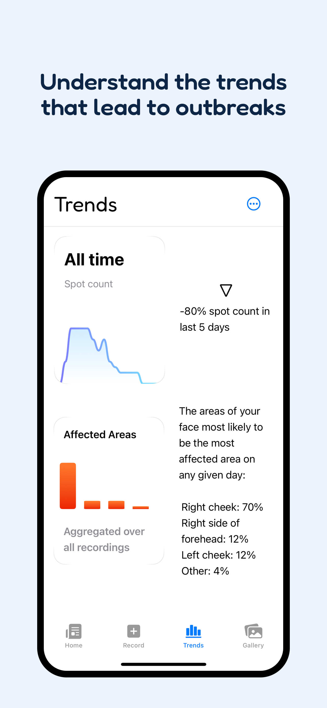
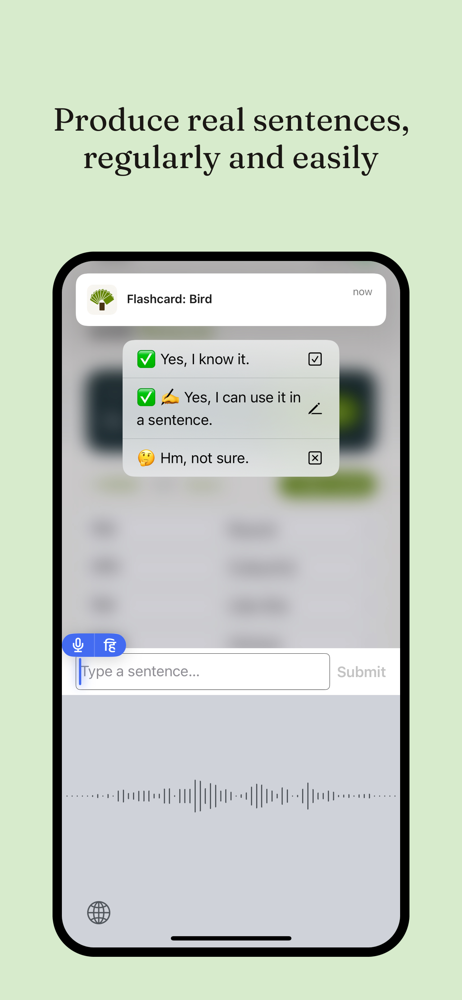

# App screenshots tool

Generates App Store screenshots (1284×2778 px) from provided iOS screenshots. 

## Sample output

- Background of a chosen colour.
- Text using the chosen colour and in a chosen font, having the configured font axes, and with the text having line breaks at the chosen places.
- Screenshot fitted inside an iPhone bezel below.

 

## Usage

```
python3 script.py --config banyan-flashcards/config.yaml
```

```
python3 script.py --config skintracker/config.yaml
```

## Example configuration

This is the configuration for my skintracker app:

- Input file basenames don't have file extensions, they find based on the basename.
- Colours are hex strings.
- Vertical bars indicate line breaks for the text.
- Font axes are based on the tvar axis order, which may or may not match the variable font's filename.
- Output files will be prefixed to preserve the order of items in the yaml list.

```yaml
inputDirectory: input
outputDirectory: output
font:
  path: Fredoka-VariableFont_wdth,wght.ttf
  axes: "550,105"
screenshots:
- inputBasename: home
  backgroundColour: FEF6F0
  textColour: "3B1F14"
  text: "Your simple home|for acne recovery"
- inputBasename: trends
  backgroundColour: EDF3FC
  textColour: "0E2646"
  text: "Understand the trends|that lead to outbreaks"
- inputBasename: gallery
  backgroundColour: F4EFF9
  textColour: "2C1545"
  text: "Save photos to see|on your progress"
- inputBasename: record
  backgroundColour: F0F7F4
  textColour: "163D2C"
  text: "Record regularly|to stay focused"
```

### Dependencies

- Python 3
- [Pillow](https://pillow.readthedocs.io/)
- [PyYAML](https://pyyaml.org/)
